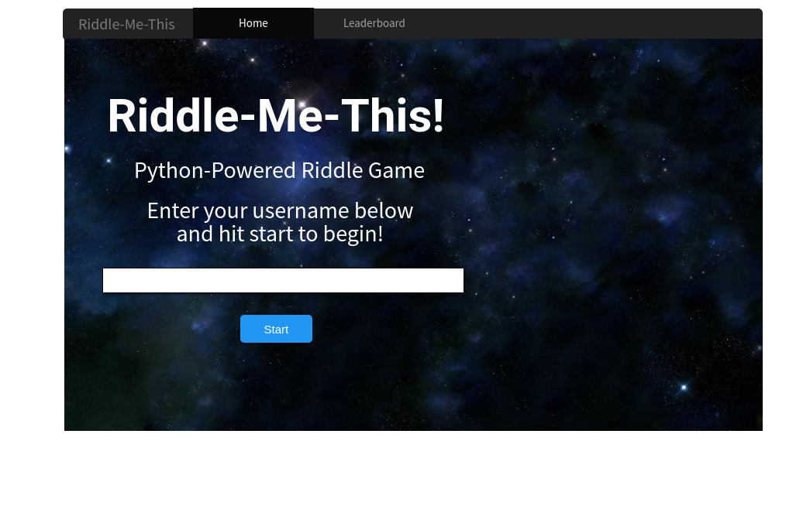
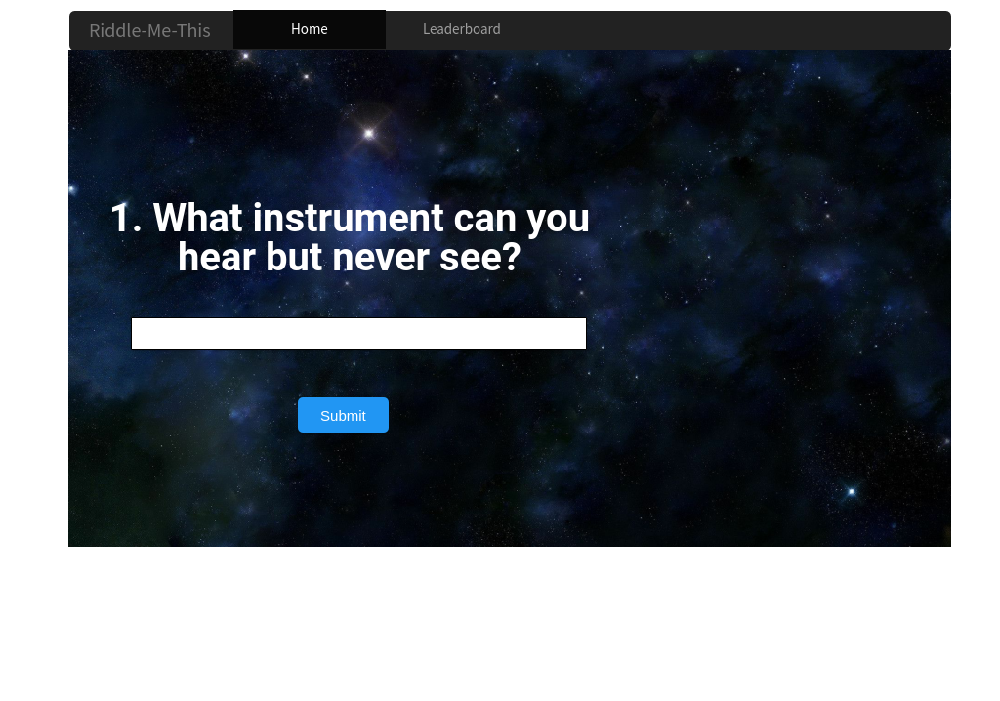

# [Practical Python Science Riddle Application](https://python-riddle-app-cs.herokuapp.com/)

I have greated this quiz style riddles game using Python based frameworks for the Practical Python module of the Code Institute Full Stack Web Development diploma.
I have chosen the theme of scientific riddles as my background is in science, and I found that doing quiz based questions helped with revision during my exams at school.
This is similar to this approach but on a smaller scale.
 
## UX

This website is aimed at anyone who has an interest in science, school age and upwards. People can use this for fun, to test their knowledge of various science facts. School age users could use this as a revision tool, as this app can be customised by adding new questions/answers to the json file.

## User Stories
  - I am a general user with an interest in science. The user would want to complete the quiz to test their knowledge of general science facts. The questions are quite varied, the user must answer each one and then their answers are displayed on the answers page. The user can see where they have placed on the leaderboard by clicking on the leaderboard button.
  - I am a school age student, using this quiz app as a fun way to revise. User flow is the same as above.
  
### Wireframes created using [Mockflow](https://www.mockflow.com/):
  - This was the initial design idea I had thought of for this app. As I was developing the app, I thought that it would be nice to add an intermediate page displaying the users answers for each question, so they can see how they performed. The user can then click to see where they placed on the leaderboard. Once I had finished coding the functionality of the app, I went back over the UI of the app to make it look better visually. I found looking through other quiz apps on [Dribbble](https://dribbble.com/search?q=quiz) really useful to gather ideas for a better design.
  

## Features
 
### Existing Features
 - The [Homepage](https://github.com/charlotteskinner90/practical_python_milestone_riddle_app/blob/master/templates/index.html) is the first port of call for the user. The user should enter their username and hit the Start button to begin the game. If the username box is empty, the game will redirect back to the homepage to force the user to enter a username.
 - Once the user hits the start button, they are redirected to the [Riddles](https://github.com/charlotteskinner90/practical_python_milestone_riddle_app/blob/master/templates/riddle.html) page. Their username is displayed at the top of the page.
 - The user should enter their answer in the input box and press the 'Next Question' button. Note: There is one question where the user could enter either a word or a number, this is accounted for in the [section of the python](https://github.com/charlotteskinner90/practical_python_milestone_riddle_app/blob/master/app.py#L68) that checks the users response.
 - On the last question, the button changes to 'Submit answers' and the user is redirected to the [Answers](https://github.com/charlotteskinner90/practical_python_milestone_riddle_app/blob/master/templates/answers.html) page. This page displayed the user's response, whether the response was correct, and the correct answer. The user's score is stored in a JSON array against their username.
 - At this point, the user can then press either the button or the navigation item to go to the [Leaderboard](https://github.com/charlotteskinner90/practical_python_milestone_riddle_app/blob/master/templates/leaderboard.html) page to see where they have placed against their peers. This page calls the JSON array storing the user scores and displays them in reverse numerical order. The top 3 users scores are displayed at the top in bold.

### Features Left to Implement
- Letting users log in to save their progress, then allow them to improve their score

## Technologies Used

In this section, you should mention all of the languages, frameworks, libraries, and any other tools that you have used to construct this project. For each, provide its name, a link to its official site and a short sentence of why it was used.

- [Flask](http://flask.pocoo.org/)
    - The project uses **Flask** , a Python micro framework to provide a functional and lightweight core for the application

- [Jinja2](http://jinja.pocoo.org/docs/2.10/)
    - This app uses the **Jinja2** for the front-end templating of the routes outlined in the app.py file. 
    - Modelled on Django's templating style, **Jinja2** is scalable and modular to allow for reusable components

- [HTML5](https://developer.mozilla.org/en-US/docs/Web/Guide/HTML/HTML5)
    - HTML used for the structure of the page templates

- [CSS3](https://developer.mozilla.org/en-US/docs/Web/CSS)
    - Language used to apply styles to each page for styling of the components (e.g. colour schemes, fonts, images)
    
- [Font Awesome](https://fontawesome.com/) is used for the icons on the page

## Testing

I included a piece of custom automated testing in the app to check whether the routing for the site was working correctly, this can be seen [here](https://github.com/charlotteskinner90/practical_python_milestone_riddle_app/blob/master/test_app.py)
The first test is for the homepage (index.html) - this looks for the response of the page (200, if the page is up for example) and then compares to see if this is equal to the 200 response status needed. If yes, the test passes.
This works the same for the second test, but for the leaderboard page.

I carried out manual testing for the user stories as follows:

- **User lands on the [homepage](https://python-riddle-app-cs.herokuapp.com/)** - _Homepage is up and showing 200 status in developer tools_
- **If user does not enter username but tries to enter game, stays on homepage** - _User stays on homepage if no username entered_
- **User enters username and clicks to start game** - _User is redirected to the riddles page with the URL of /riddle/{username}_
- **User types in answer to question and clicks to go to next question, next question is shown** - _Answer is entered, button is clicked and next question is shown_
- **Answer that could be a word or numerical value, can both be correct** - _If user enters the word or the number version of the answer, both answers are stored in the array so either can be correct and are marked as such_
- **User gets to last question and hits 'Submit Answers', answers are submitted** - _Once the user hits 'Submit Answers', their answers are stored in an answersArray. The user is redirected to the answers page with URL /riddle/{username}/answers and their answers along with the correct answers and their score are shown.
- **User clicks to see the Leaderboard** - _User is redirected to the [Leaderboard](https://python-riddle-app-cs.herokuapp.com/leaderboard) page. Users score and username is stored in a JSON array. The username and score is called in this page, and the scores are displayed in descending order._

## Bugs

- An interesting bug I came across was that the answers array kept appending to itself between users. So for example, user A would complete the quiz and their 10 answers would display on the answers page. When user B came along and completed their 10 answers, 20 answers would show on the answers page. To rectify this, I added a function called [reset_data()](https://github.com/charlotteskinner90/practical_python_milestone_riddle_app/blob/master/app.py#L103-L111) which sets the answersArray to an empty array between users.
- A second bug I came across was that the results.json file kept overwriting itself, which meant the leaderboard only ever had one or two people in it. To [fix](https://github.com/charlotteskinner90/practical_python_milestone_riddle_app/blob/master/app.py#L18-L20) this, I made it so that when we open the results.json file it loads the data that is currently in the leaderboard. The new user's score is then appended to this data and not overwriting the file.

## Deployment

This application is hosted on Heroku at: https://python-riddle-app-cs.herokuapp.com/ In order to deploy this app to heroku, I added a [Procfile](https://github.com/charlotteskinner90/practical_python_milestone_riddle_app/blob/master/Procfile) which tells heroku the language of the app and the name of the file that needs to be run - in this case this was [app.py](https://github.com/charlotteskinner90/practical_python_milestone_riddle_app/blob/master/app.py)
I then set up a [requirements.txt](https://github.com/charlotteskinner90/practical_python_milestone_riddle_app/blob/master/requirements.txt) file which holds the dependencies that this app requires in order to run. Both the Procfile an requirements.txt file are committed to the repository and pushed to Heroku.
I had to set up some environment variables inside Heroku in order for the app to appear on the live URL. The following are configured under Settings -> Reveal Config Vars
  - IP: 0.0.0.0
  - PORT: 5000

To run this app locally, please use the following steps:
  - Clone this repository and run it in an IDE of your choice.
  - Set your environment variables i.e. IP: 127.0.0.1 and PORT: 5000
  - Install dependencies required for the app to run from the requirements.txt file by running the following command in the terminal **pip install -r requirements.txt**

## Credits

### Content
- The riddles used in this game were copied from this [Science Riddles](https://www.getriddles.com/science-riddles/) site

### Media
- The image used on the background of the navigation bar is from this Wallpapers Collections [site](http://cuteweblinks.info/preview/Blue-Space-Backgrounds/Blue-Space-Backgrounds-25.html)

### Acknowledgements

- I would like to thank my colleague Rhys Bowles for bug reporting and code reviewing during this project.
